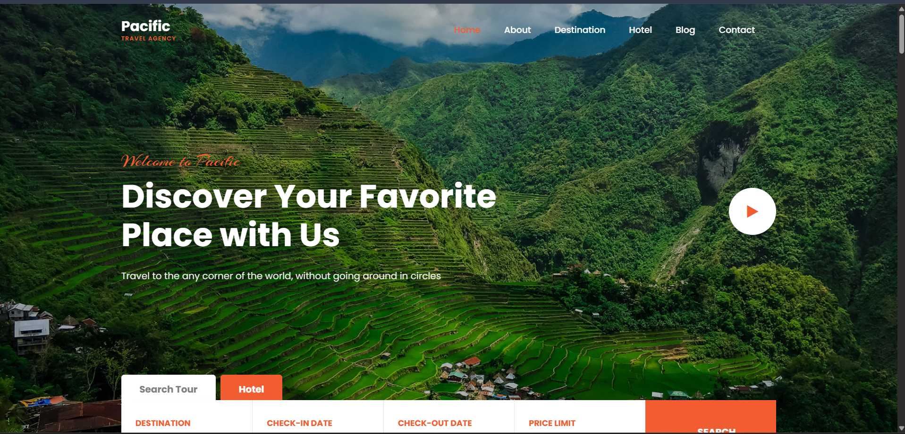
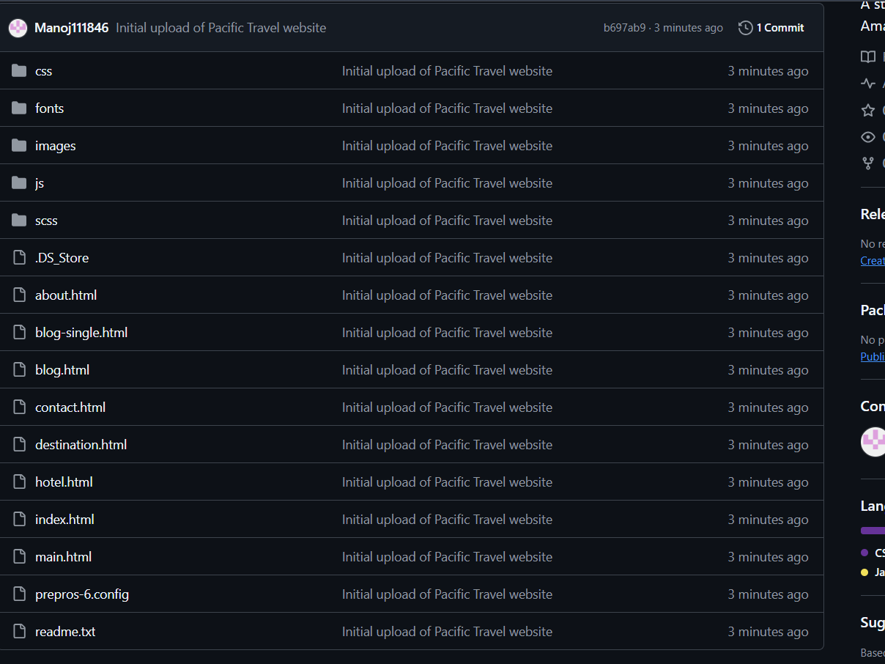
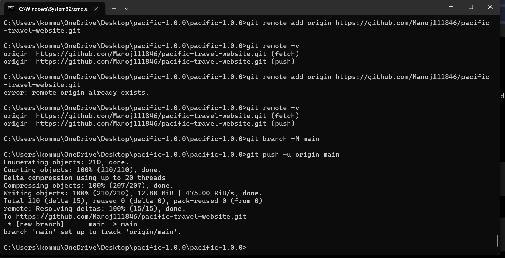
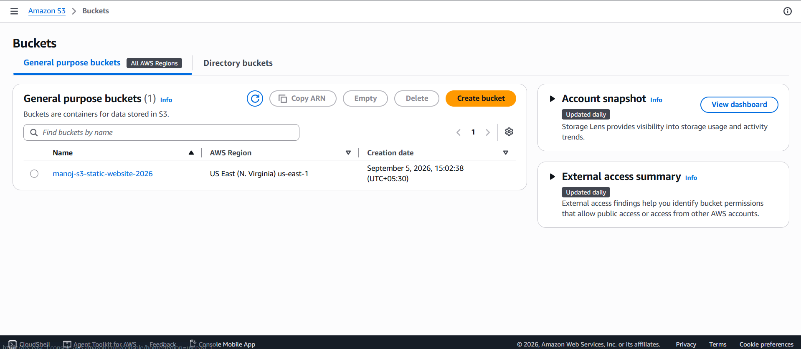
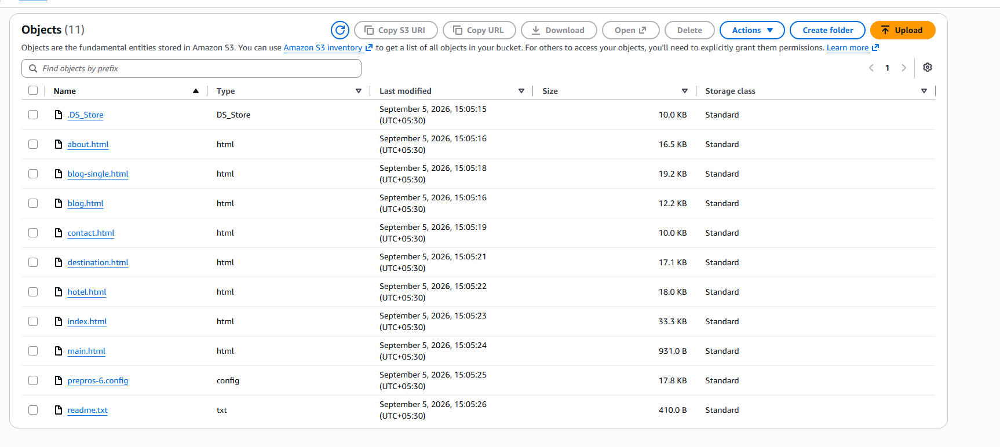
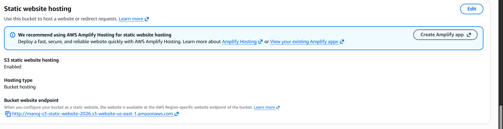
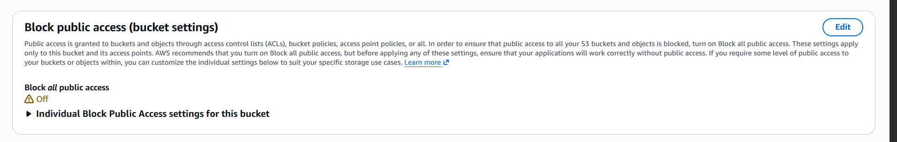
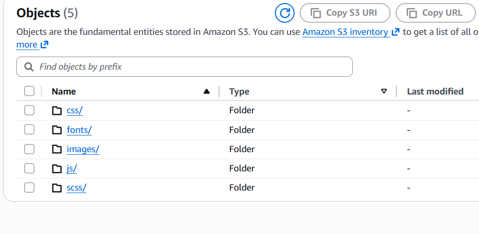
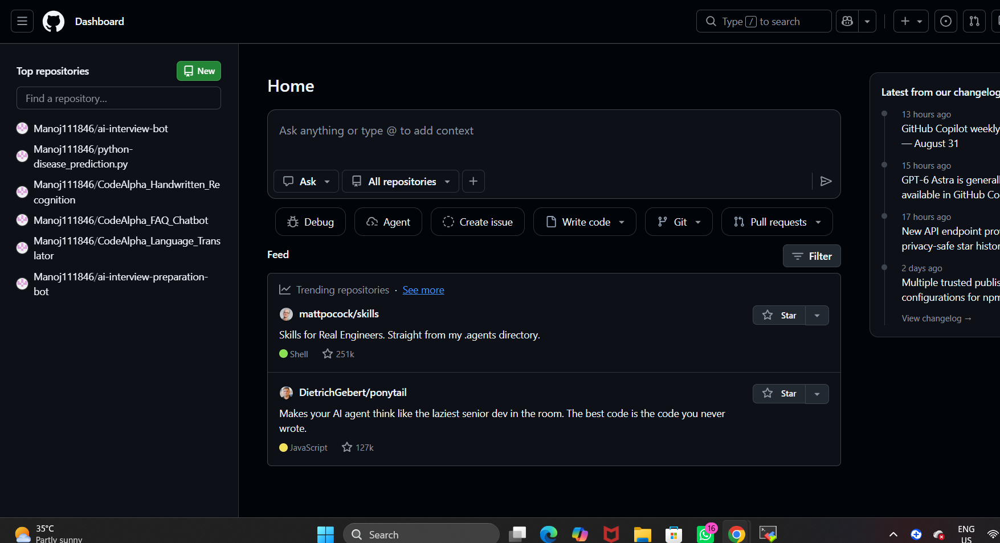
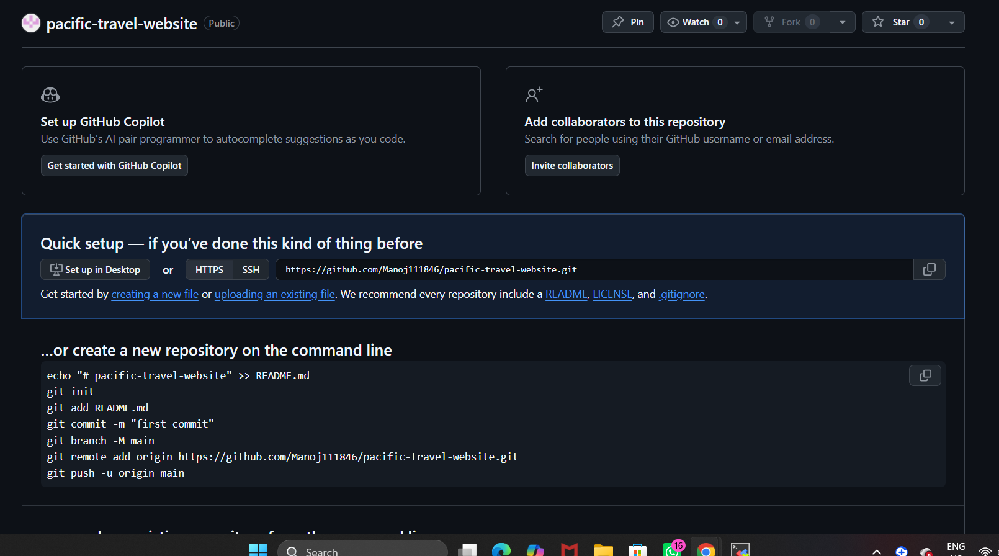

# 🌴 Pacific Travel Website

A modern responsive travel website built with **HTML, CSS, JavaScript, SCSS**, and deployed as a **static website using Amazon S3**.

## 🚀 Live Website

**Live Demo:** Your Amazon S3 Website Endpoint

## 📌 Project Overview

Pacific Travel provides an attractive interface for exploring destinations, hotels, travel blogs, and contact information.

### ✨ Features

- 🏠 Responsive Home page
- 🌍 Destination section
- 🏨 Hotel section
- 📝 Travel blog pages
- 📞 Contact page
- 📱 Responsive design
- 🎨 CSS/SCSS styling
- ⚡ JavaScript functionality
- ☁️ Amazon S3 static website hosting

## 🛠️ Technologies

| Technology | Purpose |
|---|---|
| HTML5 | Website structure |
| CSS3 | Styling |
| SCSS | Advanced styling |
| JavaScript | Interactivity |
| Amazon S3 | Static website hosting |
| Git | Version control |
| GitHub | Source-code repository |

# ☁️ AWS S3 Deployment

The website was deployed as a static website on Amazon S3.

### Deployment Steps

1. Created an S3 bucket.
2. Uploaded the website files.
3. Enabled static website hosting.
4. Configured public access/permissions as required.
5. Uploaded HTML, CSS, JavaScript, images, fonts, and assets.
6. Tested the website using the S3 website endpoint.

# 📸 Project Screenshots

> **IMPORTANT:** These images are stored in the **root of this GitHub repository**, not inside a `screenshots/` folder. Therefore the image paths below use `./filename.png`. GitHub will display the actual screenshots directly.

## 1. 🌐 Live Pacific Travel Website



## 2. 📁 GitHub Repository Files



## 3. ⬆️ Git Push Successfully Completed



## 4. 🪣 S3 Bucket



## 5. 📂 S3 Website Objects



## 6. 🌐 S3 Static Website Hosting



## 7. 🔓 S3 Public Access Configuration



## 8. 📤 S3 Uploaded Folders



## 9. 🐙 GitHub Dashboard



## 10. ⚙️ GitHub Repository Setup




# 📂 Project Structure

```text
pacific-travel-website/
│
├── css/
├── fonts/
├── images/
├── js/
├── scss/
│
├── about.html
├── blog.html
├── blog-single.html
├── contact.html
├── destination.html
├── hotel.html
├── index.html
├── main.html
│
├── 01-live-website.png
├── 02-github-repository-files.png
├── 03-git-push-success.png
├── 04-s3-bucket.png
├── 05-s3-website-objects.png
├── 06-s3-static-website-hosting.png
├── 07-s3-public-access-setting.png
├── 08-s3-uploaded-folders.png
├── 09-github-dashboard.png
├── 10-github-repository-setup.png
├── 11-local-project-folder.png
├── 12-s3-403-troubleshooting.png
├── 13-s3-404-troubleshooting.png
│
└── README.md
```

# 🎯 Project Outcome

- ✅ Website developed successfully
- ✅ Website uploaded to Amazon S3
- ✅ Static website hosting configured
- ✅ S3 website endpoint tested
- ✅ Project uploaded to GitHub
- ✅ Screenshots documented directly in README

# 👨‍💻 Author

**Manoj**

**Repository:** `pacific-travel-website`

⭐ If you found this project useful, consider giving the repository a star.
